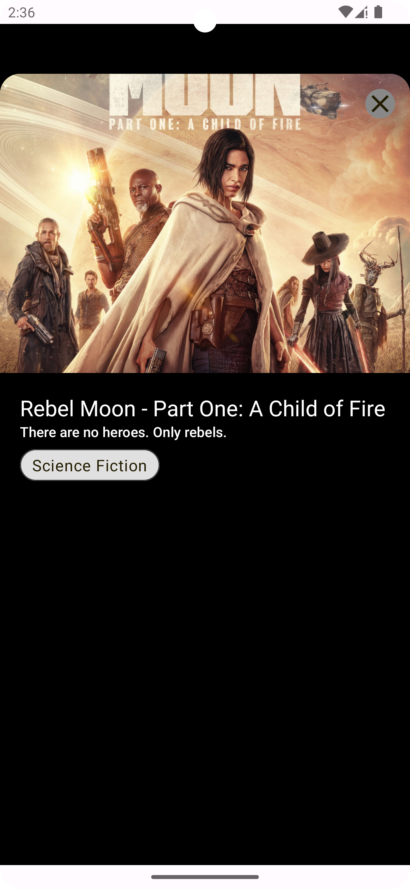

# KMM Movies App 🎬

Welcome to the KMM Movies App, a Kotlin Multiplatform Mobile application that brings the world of movies to your fingertips!

## Tech Stack

- **[Ktor](https://ktor.io/docs/getting-started-ktor-client-multiplatform-mobile.html#new-project)**: Efficient networking library for seamless API communication.
- **[Voyager](https://voyager.adriel.cafe/)**: UI toolkit simplifying the development of dynamic and interactive user interfaces.
- **[Kamel Image](https://github.com/Kamel-Media/Kamel)**: Image loading and caching to enhance the app's visual appeal.
- **[Koin](https://insert-koin.io/docs/reference/koin-mp/kmp/)**: Lightweight dependency injection framework for clean and modular code.
- **[Moko MVVM](https://github.com/icerockdev/moko-mvvm)**: Embrace the power of MVVM architecture in a Kotlin Multiplatform environment.

## Screenshots

### iOS
 

### Android
 

### Desktop
 

### Browser
 

## Feedback

Your feedback is invaluable! If you encounter any issues or have suggestions for improvement, please open an issue on the GitHub repository.

## License

This project is licensed under the [MIT License](LICENSE), so feel free to use it and extend it as you see fit.

Happy coding! 🚀📱🎉
